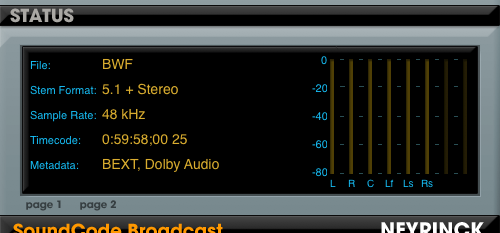
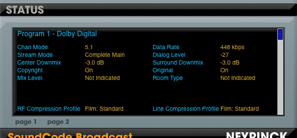

# Monitor / Import Controls Reference

## INPUT Controls

The INPUT section controls the source BWF file to be imported (AudioSuite / Standalone) or played (RTAS). These settings cannot be saved as Pro Tools presets — they are persistent and saved in a preferences file that is read when the plug-in window opens.

### Source

Selects whether a WAV file is the source audio, a live audio stream is the source audio, or **off** to output only zeros.

!!! note
    Bypassing the plug-in via the Pro Tools bypass control allows the track audio to pass through in the RTAS version.

### Browse

Launches a dialog to browse the file system and choose a WAV file for subsequent importing (AudioSuite) or playback (RTAS).

### Spot To (AudioSuite)

Controls how the audio from the WAV file is located when imported into the Pro Tools timeline:

- **Selection** — located to the start of the timeline selection.
- **Timecode** — located at the time code start of the WAV file (available if the file has embedded time code).
- **Session Start** — located to the start of the Pro Tools timeline (available if the file has no embedded time code).

### Sync To (RTAS)

Controls the timing for playing back the WAV file audio:

- **Session Start** — the start of the file is aligned with the start of the timeline.
- **Timecode** — the audio is aligned with the time code start of the WAV file (available if the file has embedded time code).

### Length (AudioSuite)

Selects how much of the WAV file is played:

- **Entire** — the entire WAV file plays no matter what length is selected in the timeline.
- **Partial** — the length of the timeline selection determines how much of the file plays.

### Counter (RTAS)

Shows the running timecode counter when playback is engaged. Shows **waiting** when the timecode has not yet reached the start of the file (if the file did not start at the beginning of the timeline), and **finished** if the running timecode has gone beyond the end time of the file.

### Play (Standalone)

Plays back the selected WAV file. Adjust the slider position to change the playback location.

## AUDIO PLAYBACK Controls

### Configuration

Selects the audio channel layout of the BWF file. If the file already contains layout information, this is set automatically. For files that do not specify a channel layout, this control lets you set it (as **5.1 + Stereo**, for example).

### Program

Selects the audio program to be imported (AudioSuite) or played (RTAS). If the file contains more than one audio program, each program is shown as a choice here, including **all programs** at the end of the list.

### Dolby E Decode Enable

Enables the Dolby E decoder.

### Dolby E Decode PCM Pass Thru

Passes PCM audio through the Dolby E decoder.

### Dolby E Decode Program

Sets which Dolby E program to import or monitor. Select the last entry to monitor or import all programs simultaneously.

### Output Channel Order (AudioSuite only)

Sets the output channel order used when importing audio from a BWF file into the session. For example, if the individual channels in a 5.1 multichannel file are in SMPTE order (L, R, C, Lfe, Ls, Rs), this control chooses between **Film** order (L, C, R, Ls, Rs, Lfe) and **SMPTE** order when importing the individual mono elements.

## STATUS Controls

The **Main**, **Dolby**, and **Prog1…Prog8** controls select between different sets of metadata information for display. Clicking them switches the status display between pages.

### Main STATUS items

{ width="420" }

- **File / Stream** — the type of audio being monitored.
- **Stem Format** — the stem format of the audio being monitored.
- **Sample Rate** — the sample rate of the audio being monitored.
- **Timecode or Timestamp** — the start SMPTE time code of the audio being monitored. The frame rate is shown at the end of the value, where **ND** indicates non-drop frame and **DF** indicates drop frame. If the file does not contain Dolby E metadata but does contain a BEXT chunk, the BEXT timestamp is displayed.

### Dolby STATUS items

{ width="420" }

Displays the Dolby E metadata associated with the audio being monitored.

### Prog1…Prog8 STATUS items

Each page displays detailed metadata information for each audio program being monitored. Refer to **Dolby Encoding Guidelines.pdf** for more information about these values.

## Dolby E Hardware Mode (RTAS only)

The RTAS Dolby E Monitor features an additional control called **hw mode**. It is enabled when the Pro Tools system is used as a standalone Dolby E decoder decoding a live Dolby E stream being monitored. It is only available when the **Input Source** is set to **Track Stream**.

When enabled, the Dolby E decode latency is one video frame. To operate correctly, the **RTAS buffer size must be set to 256** in the Playback Engine dialog.
